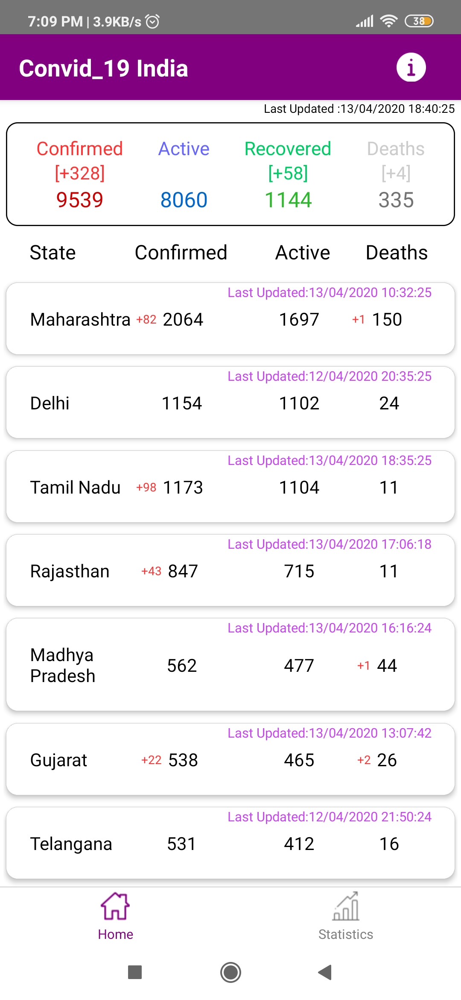
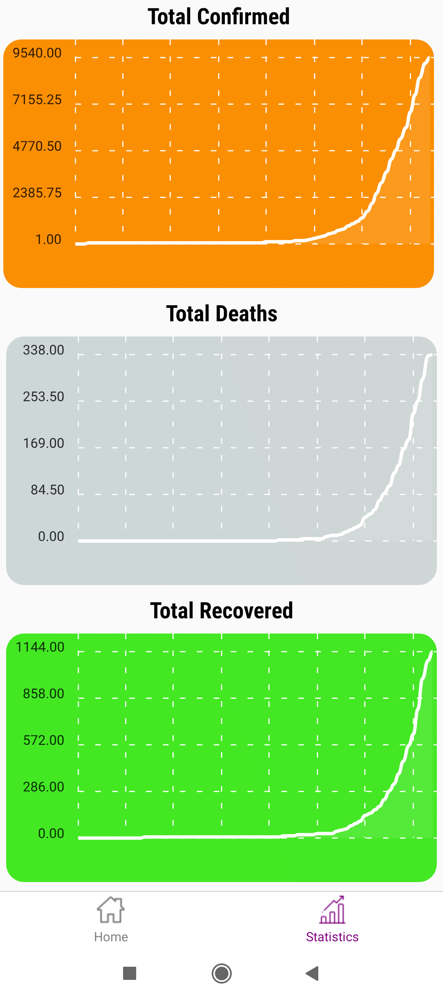
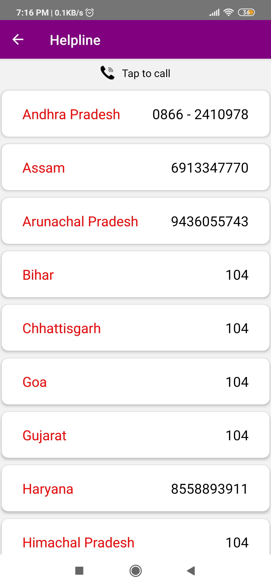

# Convid_19-India-Tracker
### About
This is an app to track convid cases in India and to be specific districtwise. 
API USED: https://api.covid19india.org/data.json & https://api.covid19india.org/state_district_wise.json
### Technology Used
React Native
### Images

### APK 
<a href='https://drive.google.com/file/d/1WpRBlyLbGjrDUUFJYSZgdhx-867J1Ena/view?usp=sharing'>Click Here to download APK</a>
